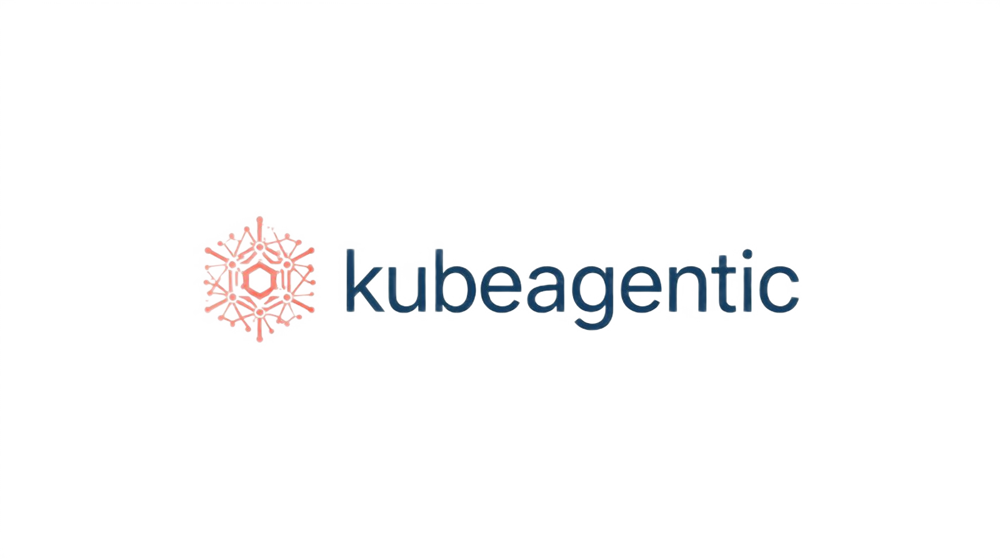

<div align="center">
  
  
  <h1>KubeAgentic</h1>
  
  <p><strong>Deploy and manage AI agents on Kubernetes with simple YAML configurations.</strong></p>
  
  <p align="center">
    <a href="https://kubeagentic.com"></a>
    <a href="https://hub.docker.com/r/sudeshmu/kubeagentic"></a>
    <a href="https://github.com/KubeAgentic-Community/KubeAgentic/releases"></a>
    <a href="https://github.com/KubeAgentic-Community/KubeAgentic/blob/main/LICENSE"></a>
    <a href="https://github.com/KubeAgentic-Community/KubeAgentic/stargazers"></a>
  </p>
</div>

---

KubeAgentic is a powerful Kubernetes operator that simplifies the deployment, management, and scaling of AI agents in your cluster. By defining your agent's configuration in a simple YAML file, you can leverage the power of Kubernetes to automate the entire lifecycle of your AI agents.

## ✨ Features

- **🤖 Multi-Provider Support**: Seamlessly switch between different AI providers, including OpenAI, Anthropic (Claude), Google (Gemini), and self-hosted vLLM models.
- **📝 Declarative Configuration**: Define your agents using standard Kubernetes Custom Resources (CRDs), making it easy to integrate with your existing GitOps workflows.

## 📖 Documentation

The complete documentation and website are available at [https://kubeagentic.com](https://kubeagentic.com).

The website source code is organized in the `website/` folder and includes:
- **Homepage**: Overview and quick start guide
- **Direct Framework Guide**: Simple, fast API calls for basic interactions
- **LangGraph Framework Guide**: Complex workflows with multi-step reasoning
- **API Reference**: Complete API specification
- **Examples**: Real-world usage examples and templates
- **Local Testing**: Development and testing guide

- **🔄 Autoscaling**: Automatically scale your agents up or down based on demand, ensuring optimal resource utilization.
- **🔒 Secure by Default**: Manage your API keys and other sensitive data using Kubernetes Secrets, ensuring they are stored securely.
- **📊 Built-in Monitoring**: Get real-time insights into the health and performance of your agents with built-in health checks and status reporting.
- **🛠️ Tool Integration**: Extend the capabilities of your agents by integrating them with custom tools and services.
- **🔗 Framework Flexibility**: Choose between simple direct API calls or complex LangGraph workflows for advanced multi-step reasoning.

## 🚀 Getting Started

This guide will walk you through the process of deploying KubeAgentic and your first AI agent.

### Prerequisites

- A running Kubernetes cluster.
- `kubectl` installed and configured to connect to your cluster.

### 1. Install KubeAgentic

You can install the KubeAgentic operator and its components using the following command:

```bash
# This will install the CRD, RBAC, and the operator deployment.
# For remote installation
kubectl apply -f https://raw.githubusercontent.com/KubeAgentic-Community/kubeagentic/main/deploy/all.yaml

# For local installation
kubectl apply -f deploy/all.yaml
```

### 🐳 Docker Images

KubeAgentic provides optimized Docker images hosted on Docker Hub:

- **Operator Image**: `sudeshmu/kubeagentic:operator-latest` (108MB)
- **Agent Runtime**: `sudeshmu/kubeagentic:agent-latest` (625MB - 66% smaller than original)

**Image Optimization Features:**
- Multi-stage builds for minimal size
- Red Hat UBI Minimal base images for security
- Non-root user execution
- Optimized Python dependencies

**Available Tags:**
- `operator-latest`: Latest stable operator
- `agent-latest`: Latest optimized agent runtime
- `agent-optimized`: Explicitly optimized agent version

```bash
# Pull images directly
docker pull sudeshmu/kubeagentic:operator-latest
docker pull sudeshmu/kubeagentic:agent-latest
```

### 2. Create an API Key Secret

Before deploying an agent, you need to create a Kubernetes secret to store your API key.

```bash
# Replace 'your-openai-api-key' with your actual OpenAI API key.
kubectl create secret generic openai-secret \
  --from-literal=api-key='your-openai-api-key'
```

### 3. Deploy Your First Agent

Create a file named `my-agent.yaml` with the following content:

```yaml
# my-agent.yaml
apiVersion: ai.example.com/v1
kind: Agent
metadata:
  name: my-assistant
spec:
  provider: openai
  model: gpt-4
  systemPrompt: "You are a helpful customer service assistant."
  apiSecretRef:
    name: openai-secret
    key: api-key
```

Now, deploy the agent to your cluster:

```bash
kubectl apply -f my-agent.yaml
```

### 4. Interact with Your Agent

Once the agent is running, you can interact with it by port-forwarding its service:

```bash
# This will forward local port 8080 to the agent's service.
kubectl port-forward service/my-assistant-service 8080:80
```

In a new terminal, you can send a message to your agent using `curl`:

```bash
curl -X POST http://localhost:8080/chat \
  -H "Content-Type: application/json" \
  -d '{"message": "Hello! How can you help me?"}'
```

Congratulations! You have successfully deployed and interacted with your first AI agent using KubeAgentic.

## 🔗 Framework Options

KubeAgentic supports two execution frameworks to match your use case:

### Direct Framework (Default)
Perfect for simple, fast interactions:

```yaml
spec:
  framework: direct  # Simple API calls
  provider: openai
  model: gpt-4
  systemPrompt: "You are a helpful assistant."
  tools:
  - name: calculator
    description: "Basic math operations"
```

- **✅ Best for**: Chat bots, simple Q&A, straightforward tool usage
- **✅ Benefits**: Fast response times, minimal resource usage, easy debugging
- **⚡ Performance**: ~100-500ms response times

### LangGraph Framework
Ideal for complex, multi-step workflows:

```yaml
spec:
  framework: langgraph  # Advanced workflows
  provider: openai
  model: gpt-4
  systemPrompt: "You are an advanced problem-solving agent."
  langgraphConfig:
    graphType: conditional
    nodes:
    - name: analyze_problem
      type: llm
      prompt: "Analyze: {user_input}"
    - name: gather_data
      type: tool
      tool: data_lookup
    - name: provide_solution
      type: llm
      prompt: "Solve based on: {data}"
    edges:
    - from: analyze_problem
      to: gather_data
    - from: gather_data
      to: provide_solution
    entrypoint: analyze_problem
```

- **✅ Best for**: Customer service workflows, research tasks, complex reasoning
- **✅ Benefits**: Stateful conversations, multi-step logic, tool orchestration
- **⚡ Performance**: ~1-5s response times (depending on workflow complexity)

## 🎯 Example Use Cases

<details>
<summary><strong>Customer Support Agent</strong></summary>

```yaml
apiVersion: ai.example.com/v1
kind: Agent
metadata:
  name: support-bot
spec:
  provider: openai
  model: gpt-4
  systemPrompt: |
    You are a friendly customer support agent. 
    Always ask for order numbers for order-related issues.
  apiSecretRef:
    name: openai-secret
    key: api-key
  replicas: 3  # Scale for high availability
```
</details>

<details>
<summary><strong>Code Review Assistant</strong></summary>

```yaml
apiVersion: ai.example.com/v1
kind: Agent
metadata:
  name: code-reviewer
spec:
  provider: claude
  model: claude-3-sonnet-20240229
  systemPrompt: |
    You are an expert code reviewer. Focus on:
    - Security vulnerabilities
    - Performance issues  
    - Best practices
  apiSecretRef:
    name: claude-secret
    key: api-key
```
</details>

<details>
<summary><strong>Internal Knowledge Assistant</strong></summary>

```yaml
apiVersion: ai.example.com/v1
kind: Agent
metadata:
  name: knowledge-bot
spec:
  provider: vllm
  model: llama2-7b-chat
  endpoint: http://my-vllm-server:8000/v1
  systemPrompt: "Answer questions about our company policies and procedures."
  apiSecretRef:
    name: internal-secret
    key: api-key
  serviceType: LoadBalancer  # Expose to employees
```
</details>

## 🏗️ How it Works

KubeAgentic follows the standard Kubernetes operator pattern. Here's a brief overview of its architecture:

- **Agent CRD**: A Custom Resource Definition that defines the `Agent` resource, allowing you to manage your agents declaratively.
- **Controller**: The core component of the operator, which runs in the cluster and watches for changes to `Agent` resources.
- **Reconciliation Loop**: When an `Agent` resource is created, updated, or deleted, the controller's reconciliation loop is triggered. It then creates or updates the necessary Kubernetes resources (Deployments, Services, etc.) to match the desired state defined in the `Agent` resource.

## 🔧 Configuration

### Basic Configuration Options

| Setting | Description | Example |
|---------|-------------|---------|
| `provider` | AI service to use | `openai`, `claude`, `gemini`, `vllm` |
| `model` | Specific model | `gpt-4`, `claude-3-sonnet`, `gemini-pro` |
| `systemPrompt` | Agent personality/instructions | `"You are a helpful assistant"` |
| `apiSecretRef` | Kubernetes secret with API key | `{name: "my-secret", key: "api-key"}` |
| `replicas` | Number of agent instances | `1` (default), `3` for HA |
| `resources` | CPU/memory limits | Standard Kubernetes resources |
| `endpoint` | Custom API endpoint | For self-hosted models |

For a detailed list of all configuration options, please refer to the [API Reference](docs/api.md).

## 📊 Monitoring Your Agents

```bash
# List all agents
kubectl get agents

# Check agent status  
kubectl describe agent my-assistant

# View agent logs
kubectl logs -l kubeagentic.ai/agent=my-assistant

# Monitor resource usage
kubectl top pods -l kubeagentic.ai/agent=my-assistant
```

## 🧪 Development

Interested in contributing to KubeAgentic? Here's how you can get started with local development.

### Prerequisites

- Go 1.21+
- Docker
- `make`

### Running the Operator Locally

You can run the operator locally against a Kubernetes cluster. This is useful for rapid development and testing.

```bash
# This will run the operator on your local machine.
make run
```

For more detailed information on local development and testing, please see our [Local Testing Guide](local-testing/README.md).

## 🔒 Security

- **🔐 API Keys**: Stored securely as Kubernetes Secrets
- **👤 Non-root**: Agents run as non-privileged users
- **🌐 Network Policies**: Control agent communication
- **🛡️ RBAC**: Fine-grained access control

## 🐛 Troubleshooting

### Common Issues

**Agent stuck in Pending state**:
```bash
# Check if the secret exists
kubectl get secret openai-secret

# Check agent events
kubectl describe agent my-assistant

# Check operator logs
kubectl logs -n kubeagentic-system deployment/kubeagentic-operator
```

**API connection errors**:
- Verify your API key is correct and has proper permissions
- Check if the endpoint is reachable (for custom endpoints)
- Ensure sufficient API quota/credits

**Resource constraints**:
```bash
# Check node resources
kubectl describe nodes

# Adjust resource requests if needed
kubectl patch agent my-assistant --type='merge' -p='{"spec":{"resources":{"requests":{"memory":"128Mi","cpu":"50m"}}}}'
```

## 🤝 Contributing

We welcome contributions from the community! If you'd like to contribute, please follow these steps:

1. **Fork** the repository.
2. **Create** a new feature branch: `git checkout -b my-new-feature`
3. **Make** your changes and add tests.
4. **Submit** a pull request.

## 📄 License

KubeAgentic is licensed under the Apache License 2.0. See the [LICENSE](LICENSE) file for more details.
